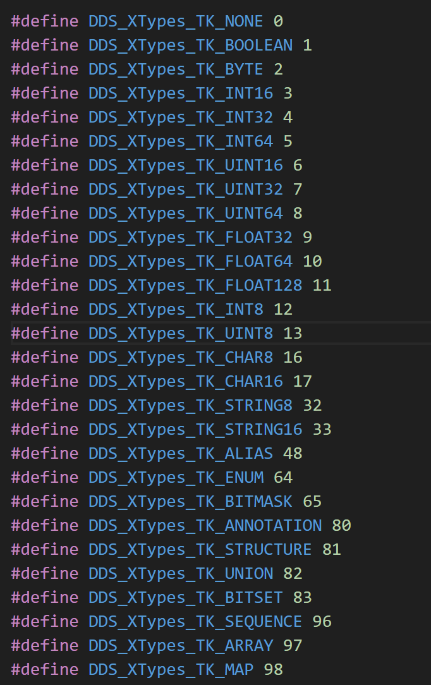
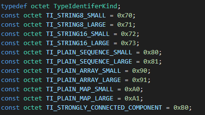
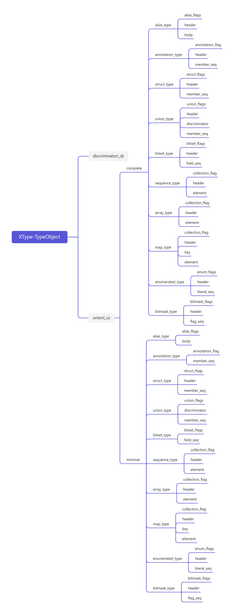
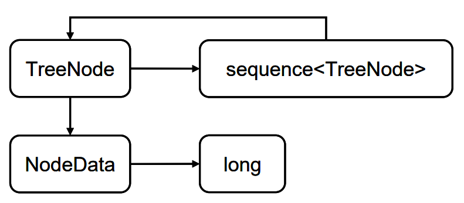
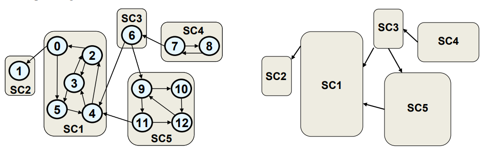
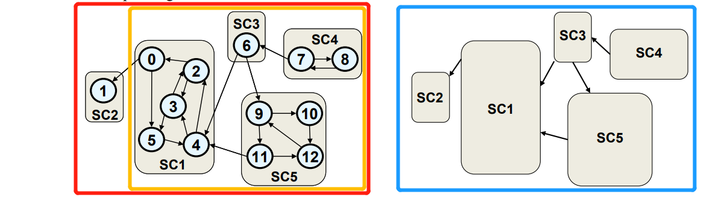

TypeIdentifier和TypeObject的内容在src/core/ddsi/include/dds/ddsi/ddsi_xt_typeinfo.h中

plain（primitive+plain collection）：TypeIdentifier足够

non-plain：TypeIdentifier+TypeObject

TypeIdentifier和TypeObject并没有封装在FastCDR当中

##### 缩写

1、EK：EquivalenceKind

三种类型：EK_MINIMAL、EK_COMPLETE、EK_BOTH

2、TI：TypeIdentifier

3、TK：TypeKind

4、SCC：Strongly Connected Components（强连通分量）

##### TypeIdentifier

分成多种类别

###### Fully-descriptive TypeIdentifiers

不涉及任何对TypeObject的哈希值的计算，完全描述这个数据类型

涉及类型：

1、原始类型、String类型

2、以上两个类型为元素的plain collection，包含的PlainCollectionHeader有EK_BOTH

###### Hash TypeIdentifiers

使用散列函数在TypeObject序列化表示上应用而计算得到

涉及类型：

1、带EK_MINIMAL、EK_COMPLETE、TI_STRONG_COMPONENT辨识符

2、带TI_PLAIN_SEQUENCE_SMALL、TI_PLAIN_SEQUENCE_LARGE、TI_PLAIN_ARRAY_SMALL、TI_PLAIN_ARRAY_LARGE、TI_PLAIN_MAP_SMALL、TI_PLAIN_MAP_LARGE辨识符，包含的PlainCollectionHeader有EK_MINIMAL和EK_COMPLETE

###### Direct Hash TypeIdentifiers

涉及类型：带EK_MINIMAL、EK_COMPLETE和TI_STRONG_COMPONENT辨识符

###### Indirect Hash TypeIdentifiers

涉及类型：元素为HASH TypeIdentifier标识的plain collections

1、带TI_PLAIN_SEQUENCE_SMALL、TI_PLAIN_SEQUENCE_LARGE、TI_PLAIN_ARRAY_SMALL、TI_PLAIN_ARRAY_LARGE、TI_PLAIN_MAP_SMALL、TI_PLAIN_MAP_LARGE辨识符

2、包含的PlainCollectionHeader有EK_MINIMAL或EK_COMPLETE

###### Minimal Hash TypeIdentifiers

涉及类型：求序列化MINIMAL TypeIdentifier的哈希

1、带EK_MINIMAL辨识符

2、带TI_STRONG_COMPONENT辨识符，包含的 TypeObjectHashID有EK_MINIMAL辨识符

3、PlainCollectionHeader的EK是EK_MINIMAL

###### Complete Hash TypeIdentifiers

涉及类型：求序列化COMPLETETypeIdentifier的哈希

1、带EK_COMPLETE辨识符

2、带TI_STRONG_COMPONENT辨识符，包含的 TypeObjectHashID有EK_COMPLETE辨识符

3、PlainCollectionHeader的EK是EK_COMPLETE

TypeKind对照XType中的Table 29

#####                             

TypeIdentifier对照XType中的Table 29

##### 

- [ ] 疑问：TypeIdentifier中的SMALL和LARGE区分的意义在于什么？


##### TypeObject

###### Complete TypeObject

在IDL中表示的任何non-plain类型都可以转换为完整的TypeObject表示形式，并且可以在不丢失信息的情况下转换回IDL，除了格式（例如空格的存在）。

###### Minimal TypeObject

提供了一种紧凑的方式来表示与远程应用程序确定类型可分配性相关的类型信息。该表示形式不包括对类型没有影响的类型信息。例如，对于具有可扩展性类型MUTABLE的类型，不包括用户定义的注释或成员的顺序等信息。

TypeObject代码中定义：                                                                                                                                                       


complete和minimal的区别在于complete的每个类型都带有一个header，而minimal中部分类型省略了这个部分。

##### 类型相等关系

满足条件：自反性、对称性、传递性

**complete equivalence：**可以在类型系统的所有实际用途中被视为相同的类型，包括代码生成或向用户显示类型信息等。

根据完全等价关系（complete equivalence），当且仅当两个类型具有相等的Fully-Descriptive TypeIdentifier或相等的Complete TypeIdentifier时，它们才是等价的。

**minimal equivalence：**在DataWriter和DataReader之间的类型兼容性/可分配性以及由数据写入者发布和由数据读取者接收的数据对象方面，可以视为相同的类型。

根据最小等价关系（minimal equivalence），当且仅当两个类型具有相等的Fully-Descriptive TypeIdentifier或相等的Minimal TypeIdentifier时，它们才是等价的。

属于同一等价类的类型具有相同的TypeObject。

- [ ] *推测：*在构造TypeObject和TypeIdentifier的时候需要选择使用MINIMAL还是COMPLETE的等价关系。EK的作用是在进行两个类型比较的时候，比较的是complete还是minimal形式的TypeObject，但是不确定。

###### 类型之间的依赖关系

类型关系还涉及数据类型之间的相互依赖关系，如TreeNode结构体依赖于NodeData结构体，因为它有以NodeData为类型的成员变量。

```c++
struct NodeData {
 long l_data;
};
struct TreeNode;
struct TreeNode {
 NodeData data;
 sequence<@external TreeNode> children;
};
```

其类型关系如下所示：



- [ ] 疑问：协议中原话"More complex dependency cycles are possible where one type depends on another, which depends on another forming a dependency chain that eventually points back to the original type." 这说明数据类型有可能是循环定义的，这样创建对象的时候不会产生死循环的情况吗？协议中的这种情况真的需要考虑吗？还是说我理解有误？

*！基于TypeObject哈希值计算类型的TypeIdentifier的“简单”算法，在类型之间存在相互依赖时会失败，因为TypeObject的构建需要知道所有依赖类型的TypeIdentifier，从而导致了循环依赖问题。*

涉及概念：有向路径、有向环，可达关系、强连通关系（图相关知识）

同时将有向图再简化成核心DAG，则将有向图中的各个强连通分量都揉成一个顶点。如下图所示，将1~12顶点划分成强连通分量SC1~SC5，并把这些分量简化为一个新的有向图。



1、**计算TypeIdentifier哈希值的基本算法**需要求序列化的TypeObject的哈希值，而构建TypeObject需要获取其所有依赖的TypeIdentifier，因此不适用于有循环依赖的情况。比如：

```c++
struct A {
  B b;
  // ...
};

struct B {
  A a;
  // ...
};
```

要计算A的TypeIdentifier需要B的TypeObject，B的TypeObject取决于A的TypeIdentifier，陷入死循环.

2、**计算TypeIdentifier哈希值的高级算法**主要解决循环依赖问题。

定义：

**EK**为想要的等价类型（Equivalence Kind）；

**Types(EK)**为一个集合的类型，这个集合当中的类型都不依赖于任何集合以外的类型；

**T**为**Types(EK)**当中我们需要计算TypeObject和TypeIdentifier的元素；

**TypeDependencyDG(T)**为包含从T可达的所有类型的依赖关系有向图；<span style="color: red;">（红色）</span>

**ReducedDependencyDG(T)**是TypeDenpendencyDG(T)的有向子图，让TypeDependencyDG(T)中没有出边的顶点都被移除，因为这些顶点不依赖于其他类型所有它们的TypeIdentifier和TypeObject可以直接计算；<span style="color: orange;">（橙色）</span>

**DependencyKernelDAG(T)**是ReducedDependencyDG(T)的核心DAG；<span style="color: blue;">（蓝色）</span>

**SCCIndex(U)**是属于该强连通分量的每个类型U的排序索引，从第一个类型开始索引为1。



算法流程：

①若TypeDependencyDG(T)没有环，那么可以直接使用基础算法递归式构建。否则进入第②步。

②直接计算除ReducedDependencyDG(T)外的没有出边的顶点的TypeIdentifier和TypeObject。

③标识ReducedDependencyDG(T)中的强连通分量，组成DependencyKernelDAG(T)

④使用深度优先算法计算DependencyKernelDAG(T)当中的每个强连通分量的TypeIdentifier：

​	a.若该强连通分量只有一个类型，根据其依赖类型的TypeIdentifier使用基本算法计算它的TypeIdentifier。

​	b.若该强连通分量有多个类型，则使用它们的完全限定类型名称的字典序对它们进行排序。

​		i. 暂时设置每个U的TypeIdentifier为：

​			• discriminator = TI_STRONGLY_CONNECTED_COMPONENT 

​			• sc_component_id = {discriminator=EK, hash= 0} 

​			• scc_length = 强连通分量的类型数

​			• scc_index = SCCIndex(U) （1 <= scc_index <= scc_length）

​		ii. 使用强连通分量中其他类型的临时TypeIdentifier构造所有类型的TypeObject。深度优先顺序确保已经计算			了强连通分量所依赖的其他类型的TypeIdentifier。

​	c. 将步骤4.b中计算得出的TypeObject按照它们的scc_index顺序放置在一个序列TypeObjectSeq中。
​	d. 对于版本为2且小端编码的序列，使用XCDR序列化TypeObjectSeq。
​	e. 计算序列化缓冲区的MD5哈希值。让EquivalenceHash(SC)为前14个字节。构造StronglyConnectedComponentId(SC)：
​		i. sc_component_id = {discriminator = EK, hash = EquivalenceHash(SC)}
​		ii. scc_length = SCC中类型的数量
​	f. 将SC中每个类型的TypeIdentifier设置为：
​		• discriminator = TI_STRONGLY_CONNECTED_COMPONENT
​		• strong_component_id = StronglyConnectedComponentId(SC)
​		• scc_index = SCCIndex(U)

- [ ] 以上算法没完全懂

​	

