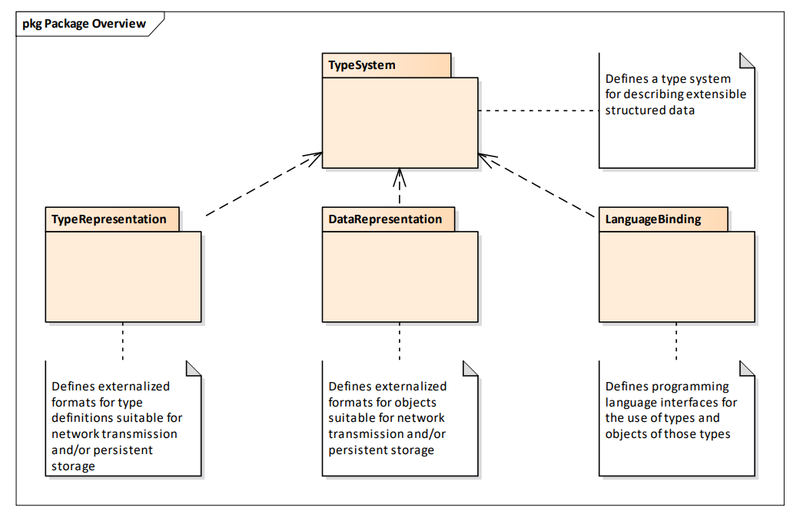
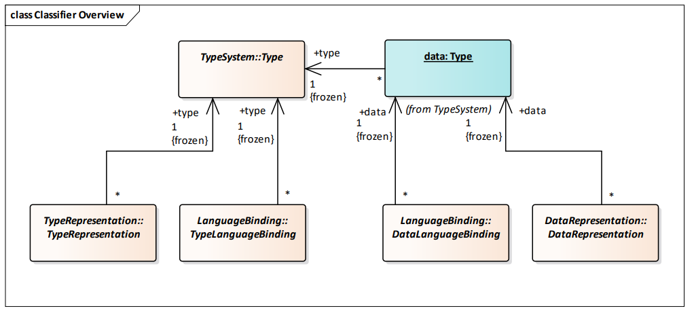
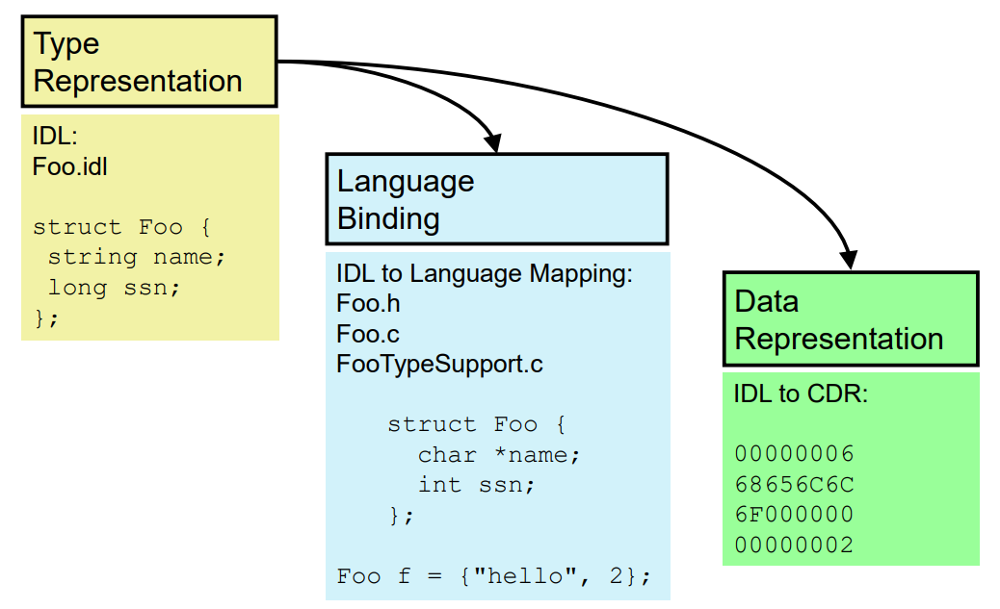

##### XType概览

TypeSystem：定义了一种用于描述可扩展的结构化数据的类型系统

- TypeRepresentation：定义了适用于网络传输和/或持久存储的类型定义的外部化格式
  - 在这部分介绍了IDL、XML和XSD三种类型定义的外部化格式，同时定义了TypeIdentifier和TypeObject
  - 这部分更侧重于类型层面的协议规定
- DataRepresentation：定义了适用于网络传输和/或持久存储的对象的外部化格式
  - 在这部分介绍了CDR的格式规定
  - 这部分更侧重于对象层面的协议规定，细分到具体的类型
- LanguageBinding：定义了用于使用类型和这些类型的对象的编程语言接口
  - 这部分前两个部分提到的类型用语言实现，主要从C和C++角度对应之前的数据类型分类

##### 四者的类之间的相互关系

**TypeSystem::Type**规定类型的逻辑或语义内容

**TypeRepresentation::TypeRepresentation**规定在外部文件或者网络数据包当中类型的表示格式（XML、XSD、IDL）

**LanguageBinding::TypeLanguageBinding**规定中间件在检查Reader和Writer之间类型兼容性，必须使用某种编程语言构造来检查这些类型

**LanguageBinding::DataLanguageBinding**规定Reader对值的访问和Writer对值的写入

**DataRepresentation::DataRepresentation**规定数据的序列化机制（CDR）

具体例子：

