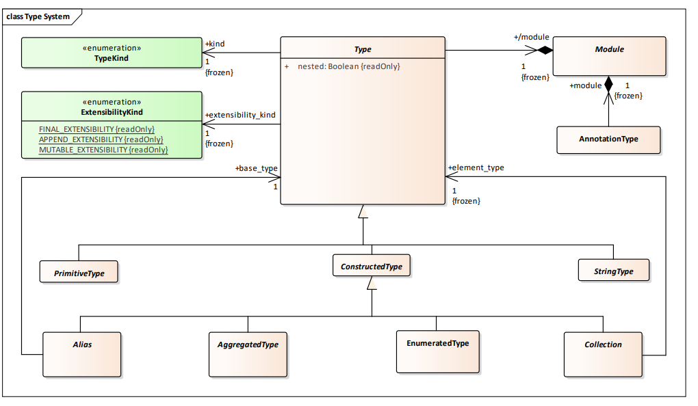

#### 概念

##### 类型进化

比如有两个版本的系统，第一个版本定义了一个类型VehicleLocationType，用IDL定义如下：

```c++
// Initial Version
struct VehicleLocationType {
 float latitude;
 float longitude;
};
```

后来，系统更新迭代有了新的版本，需要对这个类型有更加详细的定义，需要增加成员变量，在这里的例子是增加两个检测错误的字段和位置速度信息，则在新版本中定义IDL如下：

```c++
// New version
struct VehicleLocationType {
 float latitude;
 float longitude;
 float latitude_error_estimate; // added field
 float longitude_error_estimate; // added field
 float direction; // added field
 float speed; // added field
};
```

为了实现版本兼容，当拥有不同版本的组件通信时，需要固定的规则进行特殊处理。

就上面的例子来说，有以下两种情况：

- DataWriter版本initial version，DataReader版本new version，则DataReader会给多出来的字段赋一些缺省值或者被告知这些字段没有提供（如何告知目前没有说明）
- DataWriter版本new version，DataReader版本initial version，则DataReader会将多余字段剥除

- [ ] 转换细节看XType条款7.2.4

##### 类型继承

还是以VehicleLocationType为例，定义一个拓展版本VehicleLocation3DType

```C++
// Extended Location
struct VehicleLocation3DType : VehicleLocationType {
 float altitude;
 float vertical_speed;
};
```

这也有两个情况：

- 订阅主题“车辆位置”的应用程序可以接收到从写入 VehicleLocation3DType 的发布者那里发送的数据，即应用程序可以写入扩展类型并读取基本类型。换句话说，应用程序可以写入扩展类型并读取基础类型。
- 期望读取VehicleLocation3DType的DataReader可以接受VehicleLocation类型，对于那些拓展的字段，不采用任何值或者使用缺省值，取决于类型的定义

##### 稀疏类型

类型系统支持稀疏类型，其中一个类型可以有被标记为“可选”的字段，以便数据表示可以省略这些字段。为了节省网络带宽，也可以省略非可选字段的值，在这种情况下，服务将代表应用程序自动填充默认值。

- [ ] 没太理解

#### 类型系统



不同类型的extensibility kind（FINAL APPENDABLE MUTABLE）在XType7.2.2的图中的constraints里指定

##### 被使用者所理解问题（must understand）

不被使用者所理解：数据的使用者可能与数据的生产者对一个类型的定义不同。当使用者观察到它不理解的成员值时，必须能够确定是否可以忽略该成员并继续处理其他成员，还是必须丢弃整个数据样本。

- [ ] 疑问：这里的未识别如何定义？
- [ ] 疑问：这里的数据样本指什么？

一个聚合类型的每个成员都有一个Boolean类型的属性”must understand“，如果这个值为true，使用者遇到无法识别的成员则需要丢弃整个成员所在的数据样本；如果这个值为false，使用者忽略这个未识别成员

- 对于结构体，每个成员都应该有一个”must understand“的属性
- 对于联合体，discriminator成员的”must understand“需要永远被设置为true

##### 可选成员（optional）

可选成员的值可以省略，省略值表示不存在或不相关的值。在这种情况下，实现不应该提供默认值。

- 联合体成员包括discriminator不能为可选成员
- 结构体成员可以成为可选成员

optional和must understand属性值无关

##### key

*！key必须是must understand的，而且是non-optional的。*

*！一个类型的key只能包括以下类型的成员：原始类型（primitive）、聚合类型（aggregation）、枚举类型（enumeration）、位掩码类型（bitmask）、数组类型（array）和序列类型（sequence）。*

- 对于结构体，key可以是任意个数、任意成员
- 对于联合体，只有discriminator允许成为key

key成员的关系是递归的

一个聚合类型还有对应的KeyErased和KeyHolder类型，前者是将key成员都取消key，后者是将所有成员都成为key成员

##### TryConstruct

主要出现在struct和collection当中。例如在reader端需要读取一个结构体，其定义如下：

```c++
struct STRUCT1024 {
 string<1024> member;
};
```

但事实上，我们大部分时候不需要长度为1024的string，大部分的string长度不到80，因此我们需要重新定义一个结构体：

```c++
struct STRUCT128 {
 string<128> member;
};
```

但是新增这样的结构体可能会导致问题，比如破坏已有的数据和系统。如果构造失败，则尝试对原始数据进行适当的转换，以保持新旧类型兼容性的原则。

- [ ] 具体兼容问题见7.2.4

对于collection和聚合类型，对象的构造是递归进行的，其中若一个成员构造不成功，就会导致整体的构造失败，有的时候我们不希望有这样的结果，不希望因为这个就丢弃整个样本。因此有三种TryConstruct行为（针对某个成员或者元素构造失败）：

- DISCARD：若一个被嵌套的成员构造失败，整个聚合对象也无法被构造
- USE_DEFAULT：若一个成员不能被构造，则使用它的默认值
- TRIM：仅适用于string、wide string、sequence或者map，适用场景为发送端长度大于接收端长度。此时将对象修剪为接收端可以接受的长度

##### 类型可扩展性和可变性

主要体现在两个方面：添加额外字段、扩展string或sequence长度

三种可扩展性类型：

- FINAL：数据范围严格定义，且不可能向集合或聚合类型添加元素/成员。
- APPENDABLE：两个聚合类型，其中一个包含另一个的所有元素/成员，以及附加到末尾的其他元素/成员。
- MUTABLE：两个类型可以在元素/成员的添加、删除和/或置换方面不同，但是两者仍可以互相赋值。

这些可扩展性类型只对个别类型有影响，包括以下类型：

- aggregated types（structure、union）：可根据每个类别分别定义为FINAL、APPENDABLE和MUTABLE
- enumerated types（enumeration、bitmask）：可根据每个类别分别定义为FINAL或者APPENDABLE
- alias_type：与对应基础类型保持一致

*!个人理解：这里的可扩展类型针对新版本的更新，即类型进化这部分（7.2.3）*

##### 类型兼容

可赋值（is-assignable-from）的概念是将一个类型的对象的内容设置到另一个类型的对象，而不导致信息的错误解释。

T1 is-assignable-from T2满足的条件：T2对象的一个有意义的子集可以构造T1的对象而不导致错误解释，剩下的T2对象可以被检测到从而错误解释可以被避免

举例：有两个类型，T1为包含10个整型的sequence，T2为包含5个整型的sequence。任何类型为T2的对象O2都可以构造类型为T1的对象，但只有包含最多5个元素的T1对象可以构造T2对象。

- [ ] 疑问：那如何处理不能构造的那部分子集？是参考类型进化的处理方式吗？

###### 定界类型

可对该类型定界，使接收者可以在适当时候跳过该对象并处理后面的对象

- 原始类型和枚举类型是定界类型因为它们的序列化大小是固定的
- string和wstring是定界类型因为它们的元素大小固定
- collection types的元素如果是定界的，那么它本身也是定界的

###### 强可赋值

如果类型T1和T2使用MINIMAL关系等价（7.3.4.7），或者如果T1可赋值自T2，且T2是定界类型，则称T1从T2的赋值是“强”的。

##### 赋值规则

###### equivalent types

如果类型T1和T2使用MINIMAL关系等价，那它们互相可赋值，则T1 is-assignable-from T2且T2 is-assignable-from T1，但是反之不一定成立。

###### non-serialized members

在兼容检查的时候忽略

###### alias types

无论T1和T2是否为alias type，都看两者所对应的基础类型，若两者对应的基础类型满足is-assignable-from关系，则T1和T2满足is-assignable-from关系

###### primitive types

满足is-assignable-from关系的情况：

- T1为primitive type，T2为相同的primitive type
- T1为uint8，T2为边界为1-8的bitmask
- T1为uint16，T2为边界为9-16的bitmask
- T1为uint32，T2为边界为17-32的bitmask
- T1为uint64，T2为边界为33-64的bitmask

以上跟bitmask有关的赋值方法为根据(1<<position)构造整数，参考二进制转换

###### string types

若两者的元素类型满足is-assignable-from关系，且T2的对象O2的长度小于等于T1的长度，就赋值每个字符，并将O1的长度设置给O2

###### collection types

**array**

T1和T2两者is-assignable-from关系的条件为：两者均为array，bounds相同，且两者的元素类型是强赋值关系

若元素出现构造问题，参考TryConstruct处理

**sequence**

T1和T2两者is-assignable-from关系的条件为：两者均为sequence，且两者的元素类型是强赋值关系，且T2的对象O2的长度小于等于T1的长度，就赋值每个字符，并将O1的长度设置给O2

若元素出现构造问题，参考TryConstruct处理

**map**

两者均为map，两者的key类型和元素类型是强赋值关系，且T2的对象O2的长度小于等于T1的长度，就赋值每个字符，并将O1的长度设置给O2。若O2的key成员无法构造O1的key成员，则整个map对象都不能构造。

若元素类型出现构造问题，参考TryConstruct处理

###### enumerated types

**bitmask**

满足is-assignable-from关系的情况：

- 两者都为bitmask且边界相等
- T2为uint8，T1为边界为1-8的bitmask
- T2为uint16，T1为边界为9-16的bitmask
- T2为uint32，T1为边界为17-32的bitmask
- T2为uint64，T1为边界为33-64的bitmask

**enumeration**

两者均为enumeration，extensibility选项相同，在T1和T2中名称和值的对应关系相同（可以使用@ignore_literal_names注解进行修改，7.3.1）。如果是FINAL而且两者有相同的命名值

若T2任意名称和值不在T1中，则不可赋值

###### aggregated types
